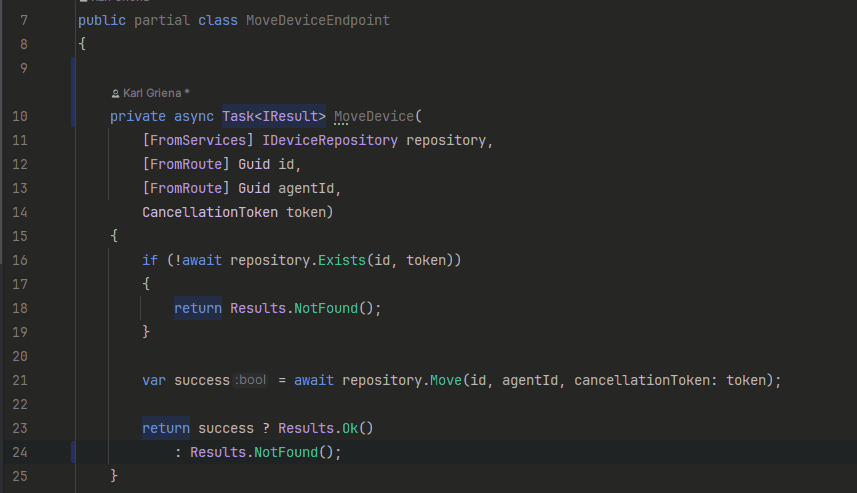

 
 

[](https://github.com/Scribbly-Fun/Scribbly.Stencil/issues)


# Scribbly Stencil

A framework for organizing and generating minimal API endpoints.


## Table of Contents
1. [🎁 Packages](#packages)
2. [🎯 Endpoints](#Endpoints)
3. [🛒 Groups](#Groups)
4. [💉 Dependency Injection](#💉DependencyInjection)
5. [🥣 Cookbook](#Cookbook)
6. [🔬 Analyzers](#Analyzers)

## Example

Below is a brief snip of code to get you started before reading more.

1. Add a reference to the `Scribbly.Stencil` package and annotate a static method on a partial class.

```csharp
[EndpointGroup("/lunch")]
public partial class LunchGroup
{
    // Annotate any method signature with the VerbEndpoint attribute
    [GetEndpoint("/{id}", "Get Lunch", "Fetches the current lunch for the provided restaurant ID.")]
    private static IResult GetLunchMenu(HttpContext context, string id)
    {
        return Results.Ok(id);
    }
    
    [PostEndpoint("/{id}", "Get Lunch", "Fetches the current lunch for the provided restaurant ID.")]
    private static IResult PostLunchMenu(HttpContext context, string id, LunchItem request)
    {
        return Results.Ok(request);
    }
}
```
*Scribbly.Stencil will generate a few things for you behind the Scenes*

2. An HTTP Endpoint Registration Method

``` csharp
public static IEndpointRouteBuilder MapLunchGroupGetLunchMenu(this IEndpointRouteBuilder builder)
{
    builder.MapPost("/{id}", PostLunchMenu);
    return builder;
}
```

3. And an Endpoint Registry for All Endpoints Mapping endpoints to Groups

```csharp
public static IEndpointRouteBuilder MapScribblyEndpoints(this IEndpointRouteBuilder builder)
{
    builder.MapLunchGroupGetLunchMenu();
    builder.MapLunchGroupPostLunchMenu();
    return builder;
} 

```

4. Simply Map Your Application

```csharp
var app = builder.Build();
app.MapStencilApp();
```

*Optionally Add a Group or Route Prefix*

```csharp
var app = builder.Build();
app.MapStencilApp("/api");
```

*Optionally map the Stencil app to a Group*

```csharp
var app = builder.Build();

var group = app
    .MapGroup("/group")
    .RequireAuthorization()
    .AddEndpointFilterFactory(((context, @delegate) =>
    {
        // ....
        return @delegate;
        
    }))
    .MapStencilApp();
```

# 🎯 Endpoints

With `Scribbly.Stencil` endpoints are declared as a static method and automatically mapped to an HTTP request. 
The generator will accept several type configurations however the enclosing class **MUST** be a ``public partial class``.
The method signature **MAY** be private or public, but **MUST** be static.  

Note: We are enforcing the use of ``static`` members to ensure your endpoints don't have a closure from the enclosing class.

```csharp
public partial class BreakfastEndpoints
{
    [PutEndpoint("/breakfast/{id}", "Edit Breakfast", "Edits a Breakfast Item")]
    private static object PutBreakfastMenu(HttpContext context, [FromRoute] string id)
    {
        return new { id = id };
    }
}
```

Any method signature supported by a Minimal API Endpoints is support by `Scribbly.Stencil`

```csharp
public partial class BreakfastEndpoints
{
    [PutEndpoint("/breakfast/{id}", "Edit Breakfast", "Edits a Breakfast Item")]
    private static Task<IResult> PutBreakfastMenu([FromQuery] string id)
    {
    }
    
    [PutEndpoint("/breakfast/{id}", "Edit Breakfast", "Edits a Breakfast Item")]
    private static Task<string> PutBreakfastMenu([FromServices] IService service)
    {
    }
}
```

The code generator will kick into action when it finds a method annotated with any of the `EndpointAttributes`


*once our APIs are stable support for more HTTP verbs will be added.*

Types can declare multiple endpoints

```csharp
public partial class BreakfastEndpoints
{
    [GetEndpoint("/breakfast/{id}", "Edit Breakfast", "Edits a Breakfast Item")]
    private static object GetBreakfastMenu(HttpContext context, [FromRoute] string id)
    {
    }
    
    [PutEndpoint("/breakfast/{id}", "Edit Breakfast", "Edits a Breakfast Item")]
    private static object PutBreakfastMenu(HttpContext context, [FromRoute] string id)
    {
    }
}
```

Endpoints can also be grouped together with a parent ``IEndpointRouteBuilder`` **see groups below for details**

```csharp

[EndpointGroup("/breakfast", "Manage Breakfast Menu")]
public partial class BreakfastGroup
{
}

[GroupMember<BreakfastGroup>]
public partial class BreakfastEndpoints
{
    [GetEndpoint("/{id}", "Edit Breakfast", "Edits a Breakfast Item")]
    private static object GetBreakfastMenu(HttpContext context, [FromRoute] string id)
    {
    }
    
    [PutEndpoint("/{id}", "Edit Breakfast", "Edits a Breakfast Item")]
    private static object PutBreakfastMenu(HttpContext context, [FromRoute] string id)
    {
    }
}
```

Group membership is Type Safe as the Generic Parameter can **ONLY** accept a ``Scribbly.Stencil.IGroup`` interface.
Membership can be added to endpoints at either the `method declaration` or the `class declartion`.

```csharp

[EndpointGroup("/breakfast", "Manage Breakfast Menu")]
public partial class BreakfastGroup
{
}

[EndpointGroup("/menu", "Manage Breakfast Menu")]
public partial class MenuGroup
{
}

[GroupMember<BreakfastGroup>]
public partial class BreakfastEndpoints
{
    [GetEndpoint("/{id}", "Edit Breakfast", "Edits a Breakfast Item")]
    private static object GetBreakfastMenu(HttpContext context, [FromRoute] string id)
    {
    }
    
    [PutEndpoint("/{id}", "Edit Breakfast", "Edits a Breakfast Item")]
    [GroupMember<MenuGroup>]    
    private static object PutBreakfastMenu(HttpContext context, [FromRoute] string id)
    {
    }
}
```
*in the example above the PutBreakfastMenu would be added the `MenuGroup` with a route /menu NOT /breakfast*

### Configuration

`Stencil` allows you to easily plug into the configuration for each endpoint generated by your Methods.
Simply add the `Configure` attribute to the `method declaration` or `class declaration` and magic 🐣


Your type will now implement a custom interface used by the code generator.  This tells `Scribbly.Stencil` to invoke your configure method allowing you to modify and append the builder.  This interface forces the compiler to guid you.

```csharp
public partial class BreakfastEndpoints
{
    [PutEndpoint("/{id}", "Edit Breakfast", "Edits a Breakfast Item")]
    [Configure]
    private static object PutBreakfastMenu(HttpContext context, [FromRoute] string id)
    {
        return new { id = id };
    }

    /// <inheritdoc />
    public void ConfigurePutBreakfastMenu(RouteHandlerBuilder putBreakfastMenuBuilder)
    {
        putBreakfastMenuBuilder.ProducesProblem(404);
    }
}
```

# 🛒 Groups

Endpoint groups can be created to map several endpoints with common routing and configuration.  ``Scribbly.Stencil``
will build this routing tree for you behind the scenes.  Just create a Group and attached members.

```csharp
[EndpointGroup("/lunch", "Manage Lunch Menu")]
public partial class LunchGroup
{
}
```

This will create a routing group.  Groups can even be members of other groups.  Use the ``GroupMember<T>`` to target a group.  Your new group will be added to the group specified in the Generic Param.

```csharp
[EndpointGroup("/menu", "Menu")]
public partial class MenuGroup
{
}

[GroupMember<MenuGroup>]
[EndpointGroup("/lunch", "Manage Lunch Menu")]
public partial class LunchGroup
{
}
```

Of course you'll need to add endpoints to groups as well yielding a routable endpoint `/menu/lunch/{id}`

```csharp
public partial class LunchEndpoints
{
    [GetEndpoint("lunch/{id}")]
    [GroupMember<LunchGroup>]
    private static IResult GetLunchMenu(HttpContext context, [FromRoute] string id)
    {
        return Results.Ok(id);
    }
}
```

Using `Scribbly.Stencil` you can also contain endpoints inside of groups.  Each endpoint will inherit the behavior of the encapsulating class.

Since the `DinnerEndpoints` in the following example and annotated with the `EndpointGroup` and the `GroupMember<MenuGroup>`
the endpoints will yield routes ``/menu/dinner/{id}`` 

```csharp
[EndpointGroup("/dinner", "Dinner time endpoints wrapped in a Group.")]
[GroupMember<MenuGroup>]
public partial class DinnerEndpoints
{
    [GetEndpoint("/{id}", "Gets Dinner", "Queries a new Dinner Item")]
    private static IResult GetDinnerMenu(HttpContext context, [FromRoute] string id)
    {
        return Results.Ok(id);
    }
    
    [PostEndpoint("/{id}", "Create Dinner", "Creates a new Dinner Item")]
    private static object PostDinnerMenu(HttpContext context, [FromRoute] string id)
    {
        return Results.Ok(id);
    }
    
    [PutEndpoint("/{id}", "Edit Dinner", "Edits a Dinner Item")]
    private static object PutDinnerMenu(HttpContext context, [FromRoute] string id)
    {
        return new { id = id };
    }
}
```

### Configuration

While this is great you may need to plug into the route building and override or append configuration to groups.

Simply add the `Configure` attribute to the `class declaration` and magic 🐣


Your type will now implement a custom interface used by the code generator.  This tells `Scribbly.Stencil` to invoke your configure method allowing you to modify and append the builder.

```csharp
[Configure]
[GroupMember<ApplicationRoot>]
[EndpointGroup("/lunch", "Manage Lunch Menu")]
public partial class LunchGroup
{
    /// <inheritdoc />
    public void Configure(RouteGroupBuilder lunchGroupBuilder)
    {
        applicationRootBuilder.AddEndpointFilter<MyFilter>();
        // .....
    }
}
```

# 💉 Dependency Injection

`Scribbly.Stencil` handlers and groups optionally support Dependency Injection using `Microsoft.Extensions.DependencyInjection`.
To utilize dependencies from without your Groups and Handlers configuration callbacks simply invoke the ``AddStencil`` method

```csharp
builder.Services.AddStencil();
```

Optional declare a service lifetime for the handlers.  This can help use scoped services out of the box.

*Note the StencilOptions.ServiceScope will be mapped to a Microsoft.Extensions.DependencyInjection.ServiceLifetime, plans to support other DI frameworks in future exist*

```csharp
builder.Services.AddStencil(options =>
{
    options.EndpointsScope = StencilOptions.ServiceScope.Scoped;
    options.GroupsScope = StencilOptions.ServiceScope.Scoped;
});
```

Once registered your groups and handler classes will be resolved from the DI container and services MAY be injected.

```csharp
public class MyOptions
{
    public string[] Tags { get; set; } = ["Menu"];
}

[EndpointGroup("/menu", "Manage Menu Items")]
[Configure]
public partial class MenuGroup(IOptions<MyOptions> options)
{
    /// <inheritdoc />
    public void Configure(RouteGroupBuilder applicationRootBuilder)
    {
        applicationRootBuilder.WithTags(options.Value.Tags);
    }
}
```

# 🔬 Analyzers

Scribbly stencil has a few analyzers packaged as well containing usage help and code fixes.

### SCRB0001

Alerts the developer when an endpoint attribute is applied to non-static method.



### SCRB0002

Alerts the developer when the an endpoint attribute is using within a non-partial class.